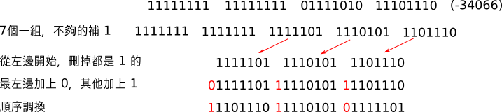
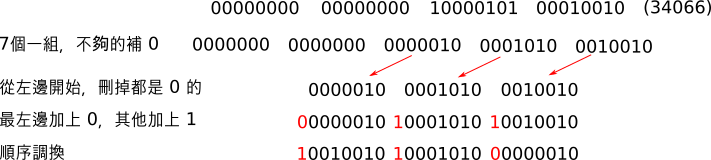

# 位元格式

大家也許會很好奇，用 wat2wasm 把文字轉成 wasm 檔的時候，跑出一大堆數字的部份是代表什麼意思？其實那就是轉換之後檔案裡實際的內容，也就是我們接下來要介紹的位元格式

## LEB128 \(Little-Endian Base 128\)

雖然整數通常會有固定長度，像是 8, 16, 32, 64 bits，但是以 32 bits 來說，實際上常常不需要用到 32 bits 來表示。為了精減大小，WebAssembly 在位元格式上常常會使用 LEB128 格式來表示整數。

### 解碼

每個 byte 只用 7 bits 表示數值，剩下的 1 bit 表示是否結束

如果長度不夠，照有號/無號整數的方式補足長度，得到有號/無號整數的數值

### 編碼

* 負數

  

* 正數

  

以 32 位元整數來說，最多用到 5 個 byte，如果全都是 1 開頭的話表示錯誤；64 位元整數最多 10 個，16 位元最多 3 個，也是用這種方法檢查錯誤

雖然在數值接近最大值的時候，是用更多位元表示相同的數，不過大部分的狀況數值不會那麼大，所以用 LEB128 可以有效的降低檔案大小

## 數值型別的位元格式

| 型別 | 數值 |
| :--- | :--- |
| i32 | 0x7f |
| i64 | 0x7e |
| f32 | 0x7d |
| f64 | 0x7c |

## 模組的位元格式

接下來講解模組中各部份的位元格式，大家可以對照 wat2wasm 的輸出結果做印證

### 前文 \(Preamble\)

這部份固定佔 8 bytes，大部分的位元格式中幾乎都會有前文，用來區別不同的位元格式

* 魔術數字 \(Magic number\) 4 bytes
  * 0x00 0x61 0x73 0x6d，用字碼轉換成文字之後就是 "\0asm"，表示這是 wasm 格式
* 版本 \(Version\) 4 bytes
  * 0x01 0x00 0x00 0x00，表示這是 0x01 版的 WebAssembly，在之前也有 0x0a, 0x0b, 0x0c, 0x0d的先行版本，之後如果推出新版的 WebAssembly，這邊就會變動

### 各部份標頭 \(Section header\)

接下來會分成許多部份 \(Section\)，對照到在 [模組](module.md) 章節一般格式的各個部份。每個部份都不是必須的，沒有用到的話就不會產生

每個部份在依開始都會有個標頭 \(header\)，標示各個部份的代碼還有長度

* 代碼 \(Section code\)

  用來區分是哪個部份

| 英文名稱 | 代碼 |
| :--- | :--- |
| Type | 1 |
| Import | 2 |
| Function | 3 |
| Table | 4 |
| Memory | 5 |
| Global | 6 |
| Export | 7 |
| Start | 8 |
| Element | 9 |
| Code | 10 |
| Data | 11 |

* 長度 \(Section size\)

  用一個 LEB128 32 位元無號整數，表示整個部份的長度 \(不包括標頭\)

  **在 wat2wasm 的輸出裡會看到這邊是 section size \(guess\)，既然是guess，表示這的值是亂猜的，不用理會，也不會被編進檔案裡**

  **真正的值在下面 FIXUP section size 的地方，在編進檔案的時候也是這個真正值會被寫到section size \(guess\)的位置上**

### 函式型別 \(Type section\)

* 數量 \(num types\)
  * 用一個 LEB128 32 位元無號整數，表示總共有多少函式型別
* 函式型別

| 欄位 | 數值或格式 | 補充說明 |
| :--- | :--- | :--- |
| 格式 | 0x60 \(func\) | 表示這是函數 |
| 參數總數 | LEB128 32 位元無號整數 |  |
| 參數型別 | 數值型別格式 | 可能沒有，也可能有多個 |
| 回傳值總數 | LEB128 32 位元無號整數 | 目前只會是 0 或 1 |
| 回傳值型別 | 數值型別格式 | 0 ~ 1 個 |

### 引入 \(Import section\)

* 數量 \(num imports\)
  * 用一個 LEB128 32 位元無號整數，表示總共有多少引入物件
* 引入物件：

| 欄位 | 數值或格式 | 補充說明 |
| :--- | :--- | :--- |
| 字串長度 | LEB128 32 位元無號整數 | 模組名稱的字串長度 |
| 模組名稱 | 字串 | 以字碼表示 |
| 字串長度 | LEB128 32 位元無號整數 | 輸出名稱的字串長度 |
| 輸出名稱 | 字串 | 以字碼表示 |
| 引入種類 | 8 位元無號整數 | 0: 函式, 1:函式表, 2:記憶體, 3:全域變數 |

在引入物件中，接下來的部份會依據不同的引入種類，而有不同的格式：

* 函式
  * 一個 LEB128 32 位元無號整數，表示函式型別的編號
* 函式表

| 欄位 | 數值或格式 | 補充說明 |
| :--- | :--- | :--- |
| 元素型別 | 0x70 \(anyfunc\) | 目前函式表只支援這個型別 |
| 標記 | 0 或 1 | 0:沒有最大值, 1:有最大值 |
| 起始大小 | LEB128 32 位元無號整數 |  |
| 最大值 | LEB128 32 位元無號整數 | 有最大值才有 |

* 記憶體

| 欄位 | 數值或格式 | 補充說明 |
| :--- | :--- | :--- |
| 標記 | 0 或 1 | 0:沒有最大值, 1:有最大值 |
| 起始大小 | LEB128 32 位元無號整數 | 以 page 為單位 |
| 最大值 | LEB128 32 位元無號整數 | 有最大值才有 |

* 全域變數

| 欄位 | 數值或格式 | 補充說明 |
| :--- | :--- | :--- |
| 數值型別 | 數值型別格式 |  |
| 可變動性 | 0 或 1 | 0:不可變動, 1:可變動 |

### 函式 \(Function section\)

* 數量 \(num functions\)
  * 用一個 LEB128 32 位元無號整數，表示總共有多少函式
* 編號
  * 一個或多個 LEB128 32 位元無號整數，表示該函式使用的函式型別編號

### 函式表 \(Table section\)

* 數量 \(num tables\)
  * 用一個 LEB128 32 位元無號整數，表示總共有多少函式表 \(目前只會是 1\)
* 函式表

| 欄位 | 數值或格式 | 補充說明 |
| :--- | :--- | :--- |
| 元素型別 | 0x70 \(anyfunc\) | 目前函式表只支援這個型別 |
| 標記 | 0 或 1 | 0:沒有最大值, 1:有最大值 |
| 起始大小 | LEB128 32 位元無號整數 |  |
| 最大值 | LEB128 32 位元無號整數 | 有最大值才有 |

### 記憶體 \(Memory section\)

* 數量 \(num memories\)
  * 用一個 LEB128 32 位元無號整數，表示總共有多少記憶體 \(目前只會是 1\)
* 記憶體

| 欄位 | 數值或格式 | 補充說明 |
| :--- | :--- | :--- |
| 標記 | 0 或 1 | 0:沒有最大值, 1:有最大值 |
| 起始大小 | LEB128 32 位元無號整數 | 以 page 為單位 |
| 最大值 | LEB128 32 位元無號整數 | 有最大值才有 |

### 全域變數 \(Global section\)

* 數量 \(num globals\)
  * 用一個 LEB128 32 位元無號整數，表示總共有多少全域變數
* 全域變數

| 欄位 | 數值或格式 | 補充說明 |
| :--- | :--- | :--- |
| 數值型別 | 數值型別格式 |  |
| 可變動性 | 0 或 1 | 0:不可變動, 1:可變動 |
| 起始值指令 | 指令 | 請參考下面"指令"小節，只能是常數指令 |
| 結束 | byte | 用一個 0x0b \(end\) 指令表示結束 |

### 輸出 \(Export section\)

* 數量 \(num exports\)
  * 用一個 LEB128 32 位元無號整數，表示總共有多少全域變數
* 輸出物件

| 欄位 | 數值或格式 | 補充說明 |
| :--- | :--- | :--- |
| 長度 | LEB128 32 位元無號整數 | 輸出名稱長度 |
| 輸出名稱 | 字串 | 以字碼表示 |
| 輸出種類 | 8 位元無號整數 | 0: 函式, 1:函式表, 2:記憶體, 3:全域變數 |
| 位址 | LEB128 32 位元無號整數 | 在儲存空間中輸出物件的位址 \(Ex: 種類是函式，表示在儲存空間中的第幾號函式\) |

### 起始函式 \(Start section\)

* 索引值 \(index\)
  * 一個 LEB128 32 位元無號整數，表示起始函式在模組中的編號

### 函式表元素 \(Element section\)

* 數量 \(num elements\)
  * 用一個 LEB128 32 位元無號整數，表示總共有多少函式表元素
* 函式表元素
  * 會根據這邊的資料，指定函式表的值

| 欄位 | 數值或格式 | 補充說明 |
| :--- | :--- | :--- |
| 索引值 | LEB128 32 位元無號整數 | 函式表的編號\(目前只會是 0\) |
| 位移 | 指令 | 請參考下面"指令"小節，只能是常數指令 |
| 元素數量 | LEB128 32 位元無號整數 | 表示有幾個元素要指定 |
| 元素 | LEB128 32 位元無號整數 | $$\ge 0$$ 個模組中函式的編號 |

### 程式碼 \(Code section\)

程式碼部份表示函式的內容

* 數量 \(num functions\)
  * 用一個 LEB128 32 位元無號整數，表示總共有多少函式內容
* 函式內容

| 欄位 | 數值或格式 | 補充說明 |
| :--- | :--- | :--- |
| 長度 | LEB128 32 位元無號整數 | 函式內容的總長度 |
| 區域變數數量 | LEB128 32 位元無號整數 | 區域變數的總數 |
| 區域變數 | 區域變數 | $$\ge 0$$ 個區域變數，請參考下面"區域變數"格式 |
| 函式內容 | byte | $$\ge 0$$ 個指令，請參考下面"指令"小節 |
| 結束 | byte | 一個 0x0b \(end\) 指令表示結束 |

* 區域變數 \(在函式內容裏面\)

  相同種類且接連在一起宣告的區域變數，會合併成一個區域變數格式，所以才會有"數量"欄位

| 欄位 | 數值或格式 | 補充說明 |
| :--- | :--- | :--- |
| 數量 | LEB128 32 位元無號整數 | 表示要宣告幾個區域變數 |
| 數值型別 | 數值型別格式 |  |

### 資料 \(Data section\)

資料部份表示記憶體的初始資料

* 數量 \(num data\)
  * 用一個 LEB128 32 位元無號整數，表示總共有多少資料指定物件
* 資料指定物件

| 欄位 | 數值或格式 | 補充說明 |
| :--- | :--- | :--- |
| 索引值 | LEB128 32 位元無號整數 | 記憶體的編號\(目前只會是 0\) |
| 位移 | 指令 | 請參考下面"指令"小節，只能是常數指令 |
| 長度 | LEB128 32 位元無號整數 | 表示要指定的資料總長度 |
| 資料 | byte | $$\ge 0$$ 個資料內容的 byte |

## 指令

指令的部份大部份是一個 byte 編碼，有些指令會加上額外的參數

### 控制指令

| 指令 | byte 編碼 | 額外參數 |
| :--- | :--- | :--- |
| unreachable | 0x00 |  |
| nop | 0x01 |  |
| block | 0x02 | 一個數值型別表示回傳值，或 0x40 表示沒回傳值 |
| loop | 0x03 | 一個數值型別表示回傳值，或 0x40 表示沒回傳值 |
| if | 0x04 | 一個數值型別表示回傳值，或 0x40 表示沒回傳值 |
| else | 0x05 |  |
| end | 0x0b |  |
| br | 0x0c | 跳回層數 : LEB128 32 位元無號整數 |
| br\_if | 0x0d | 跳回層數 : LEB128 32 位元無號整數 |
| br\_table | 0x0e | 請見下面 "br\_table 額外參數" |
| return | 0x0f |  |
| call | 0x10 | 函式編號 : LEB128 32 位元無號整數 |
| call\_indirect | 0x11 | 函式型別編號 : LEB128 32 位元無號整數 ；保留值 : 0x00 |

* br\_table 額外參數
  * 跳回層數數量 : 一個 LEB128 32 位元無號整數
  * 跳回層數 : $$\ge 1$$ 個 LEB128 32 位元無號整數

### 參數指令

| 指令 | byte 編碼 | 額外參數 |
| :--- | :--- | :--- |
| drop | 0x1a |  |
| select | 0x1b |  |
| get\_local | 0x20 | 區域變數編號 : LEB128 32 位元無號整數 |
| set\_local | 0x21 | 區域變數編號 : LEB128 32 位元無號整數 |
| tee\_local | 0x22 | 區域變數編號 : LEB128 32 位元無號整數 |
| get\_global | 0x23 | 全域變數編號 : LEB128 32 位元無號整數 |
| set\_global | 0x24 | 全域變數編號 : LEB128 32 位元無號整數 |

### 記憶體指令

| 指令 | byte 編碼 | 額外參數 |
| :--- | :--- | :--- |
| i32.load | 0x28 | 請見下面"記憶體額外參數" |
| i64.load | 0x29 | 請見下面"記憶體額外參數" |
| f32.load | 0x2a | 請見下面"記憶體額外參數" |
| f64.load | 0x2b | 請見下面"記憶體額外參數" |
| i32.load8\_s | 0x2c | 請見下面"記憶體額外參數" |
| i32.load8\_u | 0x2d | 請見下面"記憶體額外參數" |
| i32.load16\_s | 0x2e | 請見下面"記憶體額外參數" |
| i32.load16\_u | 0x2f | 請見下面"記憶體額外參數" |
| i64.load8\_s | 0x30 | 請見下面"記憶體額外參數" |
| i64.load8\_u | 0x31 | 請見下面"記憶體額外參數" |
| i64.load16\_s | 0x32 | 請見下面"記憶體額外參數" |
| i64.load16\_u | 0x33 | 請見下面"記憶體額外參數" |
| i64.load32\_s | 0x34 | 請見下面"記憶體額外參數" |
| i64.load32\_u | 0x35 | 請見下面"記憶體額外參數" |
| i32.store | 0x36 | 請見下面"記憶體額外參數" |
| i64.store | 0x37 | 請見下面"記憶體額外參數" |
| f32.store | 0x38 | 請見下面"記憶體額外參數" |
| f64.store | 0x39 | 請見下面"記憶體額外參數" |
| i32.store8 | 0x3a | 請見下面"記憶體額外參數" |
| i32.store16 | 0x3b | 請見下面"記憶體額外參數" |
| i64.store8 | 0x3c | 請見下面"記憶體額外參數" |
| i64.store16 | 0x3d | 請見下面"記憶體額外參數" |
| i64.store32 | 0x3e | 請見下面"記憶體額外參數" |
| current\_memory | 0x3f | 保留值 : 0x00 |
| grow\_memory | 0x40 | 保留值 : 0x00 |

* 記憶體額外參數
  * 對齊 \(alignment\) : 一個 LEB128 32 位元無號整數

    \(WasmVM 不會用到這個值\)

  * 位移 \(offset\) : 一個 LEB128 32 位元無號整數

### 常數指令

| 指令 | byte 編碼 | 額外參數 |
| :--- | :--- | :--- |
| i32.const | 0x41 | 數值 : LEB128 32 位元**有**號整數 |
| i64.const | 0x42 | 數值 : LEB128 **64** 位元**有**號整數 |
| f32.const | 0x43 | 數值 : 4 個 byte 表示單精度浮點數 |
| f64.const | 0x44 | 數值 : 8 個 byte 表示雙精度浮點數 |

### 算術指令

| 指令 | byte 編碼 | 額外參數 |
| :--- | :--- | :--- |
| i32.eqz | 0x45 |  |
| i32.eq | 0x46 |  |
| i32.ne | 0x47 |  |
| i32.lt\_s | 0x48 |  |
| i32.lt\_u | 0x49 |  |
| i32.gt\_s | 0x4a |  |
| i32.gt\_u | 0x4b |  |
| i32.le\_s | 0x4c |  |
| i32.le\_u | 0x4d |  |
| i32.ge\_s | 0x4e |  |
| i32.ge\_u | 0x4f |  |
| i64.eqz | 0x50 |  |
| i64.eq | 0x51 |  |
| i64.ne | 0x52 |  |
| i64.lt\_s | 0x53 |  |
| i64.lt\_u | 0x54 |  |
| i64.gt\_s | 0x55 |  |
| i64.gt\_u | 0x56 |  |
| i64.le\_s | 0x57 |  |
| i64.le\_u | 0x58 |  |
| i64.ge\_s | 0x59 |  |
| i64.ge\_u | 0x5a |  |
| f32.eq | 0x5b |  |
| f32.ne | 0x5c |  |
| f32.lt | 0x5d |  |
| f32.gt | 0x5e |  |
| f32.le | 0x5f |  |
| f32.ge | 0x60 |  |
| f64.eq | 0x61 |  |
| f64.ne | 0x62 |  |
| f64.lt | 0x63 |  |
| f64.gt | 0x64 |  |
| f64.le | 0x65 |  |
| f64.ge | 0x66 |  |
| i32.clz | 0x67 |  |
| i32.ctz | 0x68 |  |
| i32.popcnt | 0x69 |  |
| i32.add | 0x6a |  |
| i32.sub | 0x6b |  |
| i32.mul | 0x6c |  |
| i32.div\_s | 0x6d |  |
| i32.div\_u | 0x6e |  |
| i32.rem\_s | 0x6f |  |
| i32.rem\_u | 0x70 |  |
| i32.and | 0x71 |  |
| i32.or | 0x72 |  |
| i32.xor | 0x73 |  |
| i32.shl | 0x74 |  |
| i32.shr\_s | 0x75 |  |
| i32.shr\_u | 0x76 |  |
| i32.rotl | 0x77 |  |
| i32.rotr | 0x78 |  |
| i64.clz | 0x79 |  |
| i64.ctz | 0x7a |  |
| i64.popcnt | 0x7b |  |
| i64.add | 0x7c |  |
| i64.sub | 0x7d |  |
| i64.mul | 0x7e |  |
| i64.div\_s | 0x7f |  |
| i64.div\_u | 0x80 |  |
| i64.rem\_s | 0x81 |  |
| i64.rem\_u | 0x82 |  |
| i64.and | 0x83 |  |
| i64.or | 0x84 |  |
| i64.xor | 0x85 |  |
| i64.shl | 0x86 |  |
| i64.shr\_s | 0x87 |  |
| i64.shr\_u | 0x88 |  |
| i64.rotl | 0x89 |  |
| i64.rotr | 0x8a |  |
| f32.abs | 0x8b |  |
| f32.neg | 0x8c |  |
| f32.ceil | 0x8d |  |
| f32.floor | 0x8e |  |
| f32.trunc | 0x8f |  |
| f32.nearest | 0x90 |  |
| f32.sqrt | 0x91 |  |
| f32.add | 0x92 |  |
| f32.sub | 0x93 |  |
| f32.mul | 0x94 |  |
| f32.div | 0x95 |  |
| f32.min | 0x96 |  |
| f32.max | 0x97 |  |
| f32.copysign | 0x98 |  |
| f64.abs | 0x99 |  |
| f64.neg | 0x9a |  |
| f64.ceil | 0x9b |  |
| f64.floor | 0x9c |  |
| f64.trunc | 0x9d |  |
| f64.nearest | 0x9e |  |
| f64.sqrt | 0x9f |  |
| f64.add | 0xa0 |  |
| f64.sub | 0xa1 |  |
| f64.mul | 0xa2 |  |
| f64.div | 0xa3 |  |
| f64.min | 0xa4 |  |
| f64.max | 0xa5 |  |
| f64.copysign | 0xa6 |  |
| i32.wrap/i64 | 0xa7 |  |
| i32.trunc\_s/f32 | 0xa8 |  |
| i32.trunc\_u/f32 | 0xa9 |  |
| i32.trunc\_s/f64 | 0xaa |  |
| i32.trunc\_u/f64 | 0xab |  |
| i64.extend\_s/i32 | 0xac |  |
| i64.extend\_u/i32 | 0xad |  |
| i64.trunc\_s/f32 | 0xae |  |
| i64.trunc\_u/f32 | 0xaf |  |
| i64.trunc\_s/f64 | 0xb0 |  |
| i64.trunc\_u/f64 | 0xb1 |  |
| f32.convert\_s/i32 | 0xb2 |  |
| f32.convert\_u/i32 | 0xb3 |  |
| f32.convert\_s/i64 | 0xb4 |  |
| f32.convert\_u/i64 | 0xb5 |  |
| f32.demote/f64 | 0xb6 |  |
| f64.convert\_s/i32 | 0xb7 |  |
| f64.convert\_u/i32 | 0xb8 |  |
| f64.convert\_s/i64 | 0xb9 |  |
| f64.convert\_u/i64 | 0xba |  |
| f64.promote/f32 | 0xbb |  |
| i32.reinterpret/f32 | 0xbc |  |
| i64.reinterpret/f64 | 0xbd |  |
| f32.reinterpret/i32 | 0xbe |  |
| f64.reinterpret/i64 | 0xbf |  |

